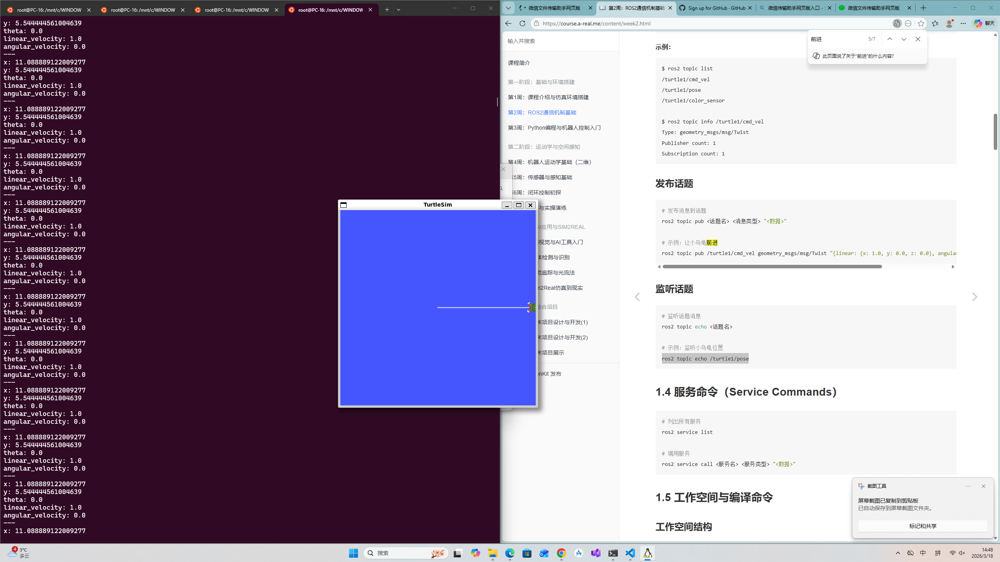

#!/usr/bin/env python3
"""
让小乌龟直行的Python节点
"""

import rclpy
from rclpy.node import Node
from geometry_msgs.msg import Twist

class StraightMover(Node):
    """控制小乌龟直行的节点"""

    def __init__(self):
        # 节点名
        super().__init__('straight_mover')

        # 创建发布者：发布到 /turtle1/cmd_vel
        # Twist 是速度消息类型
        # 10 是队列大小
        self.cmd_vel_pub = self.create_publisher(
            Twist, 
            '/turtle1/cmd_vel', 
            10
        )

        # 创建定时器：每0.1秒调用一次 callback
        self.timer = self.create_timer(0.1, self.timer_callback)

        self.get_logger().info('🚀 直行控制节点已启动！')

    def timer_callback(self):
        """定时器回调函数：每0.1秒执行一次"""

        # 创建速度消息
        msg = Twist()
        msg.linear.x = 1.0    # 前进 1 m/s
        msg.angular.z = 0.0   # 不旋转

        # 发布消息
        self.cmd_vel_pub.publish(msg)

        # 打印日志
        self.get_logger().info('Published: linear.x=1.0')

def main(args=None):
    rclpy.init(args=args)
    node = StraightMover()

    try:
        rclpy.spin(node)
    except KeyboardInterrupt:
        pass
    finally:
        node.destroy_node()
        rclpy.shutdown()

if __name__ == '__main__':
    main()

    先把程序文件保存好，再运行小乌龟节点
    运行python程序控制自己的小乌龟
  