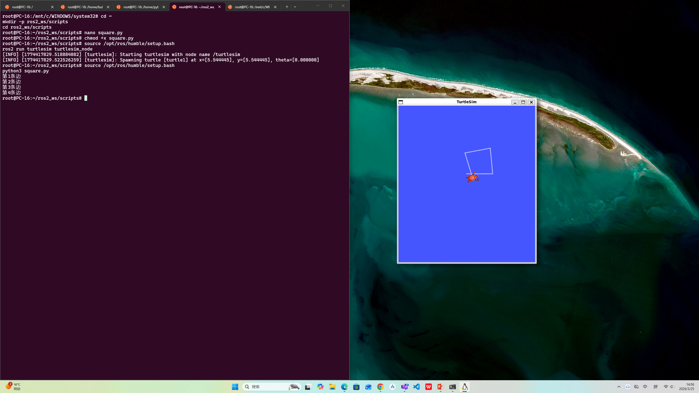
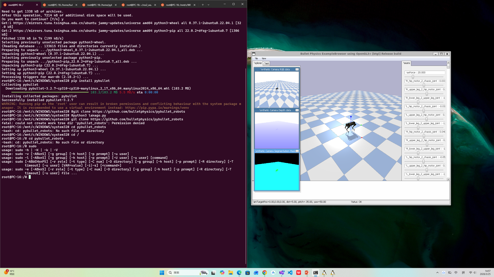
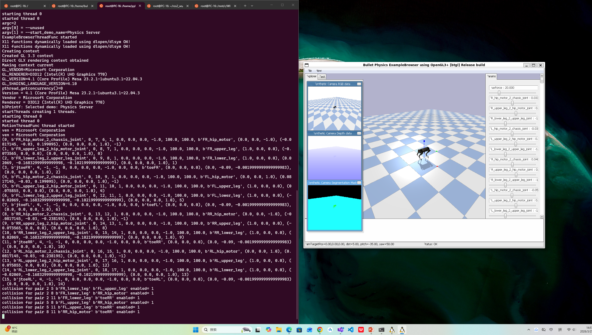

# 画圆形状的伪代码示例 
for theta in range(0, 360, step):    
  x = center_x + R * cos(theta) 
  y = center_y + R * sin(theta) 
  z = center_z robot.move_lin(x, y, z) 

# 直线运动到下一个微小点
计算逆运动学：
p.calculateInverseKinematics( pandaId, 11, [tx, ty, tz], 

运行机器狗仿真程序
#git clone https://github.com/bulletphysics/pybullet_robots
#python3 laikago.py

      